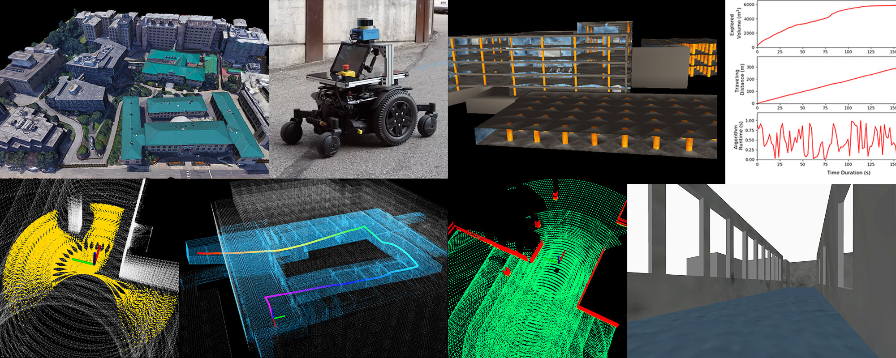

Note: This is the open source code of CMU, and it is only suitable for our platform. Please find the original program on the official website.



The repository is meant for leveraging system development and robot deployment for ground-based autonomous navigation and exploration. Containing a variety of simulation environments, autonomous navigation modules such as collision avoidance, terrain traversability analysis, waypoint following, etc, and a set of visualization tools, users can develop autonomous navigation systems and later on port those systems onto real robots for deployment.

Please use instructions on our [project page](https://www.cmu-exploration.com).

和原版的差别：
1. 修改了 /cmd_vel 话题的消息类型，方法是定义了一个接收话题的节点为 remapTwist 。
2. 修改了机器人的尺寸、速度，以及激光雷达传感器的位置，并重新根据需要运行了生成路径的 matlab 脚本。

实车测试使用方法：

新开终端并输入以下命令：
```shell

# 新开终端
cd autonomous_exploration_development_environment
source ./devel/setup.bash
roslaunch vehicle_simulator system_real_robot.launch

# 此时桌面是没有输出的，需要新建终端另外打开 vehicle_simulator.rviz
#　在　vehicle_simulator.rviz　目录下运行如下命令：
rviz -d vehicle_simulator.rviz 
```

